# WebSense

[](https://www.typescriptlang.org/)
[](https://nodejs.org/)
[](LICENSE)
[](https://prettier.io/)
[](https://eslint.org/)

An agentic search pipeline that combines Google Custom Search with local LLM synthesis via LM Studio.

## Features

- **Search**: Query Google CSE for relevant web results
- **Scrape**: Extract clean content using Readability
- **Synthesize**: Generate coherent answers with local LLM
- **Budget**: Smart context management for optimal performance

## Architecture Flow

```mermaid
flowchart LR
  %% WebSense — Search → Scrape → Synthesize (LM Studio)

  A[User / Client App] -->|POST /v1/answer - query| B[Express API Layer]

  subgraph S[WebSense Server - Express + TypeScript]
    direction LR

    B --> C[Validate Request - zod]
    C -->|ok| D[Agent Service - orchestrator]
    C -->|invalid| X1[[400 Bad Request]]

    %% Search
    subgraph SA[Search Adapter]
      direction TB
      D --> E[Build Google CSE query]
      E --> F[Google CSE API call]
      F --> G[Normalize and de-duplicate URLs]
    end

    %% Scrape
    subgraph SC[Scraper]
      direction TB
      G --> H[Concurrent fetch - p-limit, undici]
      H --> I{HTML content?}
      I -- yes --> J[Extract with jsdom + Readability]
      I -- no  --> K[[Skip or fallback]]
      J --> L[Sanitize and cleanup - collapse whitespace]
    end

    %% Budgeting
    subgraph SB[Budgeting / Packing]
      direction TB
      L --> M[Per-doc budget - PER_DOC_CHAR_BUDGET]
      M --> N[Assemble context until TOTAL_CONTEXT_CHAR_BUDGET]
    end

    %% Synthesis
    subgraph SL[LLM Synthesis]
      direction TB
      N --> O[Compose system & user prompts - anti-injection guard]
      O --> P[LM Studio client - chat/completions]
      P --> Q[(LM Studio)]
      Q --> R[Answer with citations]
    end

    R --> T[Format JSON - answer, sources, meta]
    T --> U[Return 200 OK]
  end

  %% External services
  F -.->|HTTPS| GSE[(Google Programmable Search)]
  H -.->|HTTPS| WP[(Target web pages)]
  P -.->|HTTP| Q

  %% Error & partials
  E -->|quota / rate limit| X2[[429 or 502 upstream]]
  H -->|timeouts / failures| X3[[Partial sources - meta.partial = true]]
  P -->|unavailable| X4[[502 LLM unavailable]]
```



## Quick Start

1. **Install dependencies**

   ```bash
   pnpm install
   ```

2. **Configure environment**

   ```bash
   cp env.example .env
   # Edit .env with your API keys
   ```

3. **Start development server**

   ```bash
   pnpm run dev
   ```

4. **Test endpoints**

   ```bash
   # Health check
   curl http://localhost:3000/v1/health

   # Answer query
   curl -X POST http://localhost:3000/v1/answer \
     -H "Content-Type: application/json" \
     -d '{"query": "What is TypeScript?"}'
   ```

   Check `postman/` folder for the Postman Collection

## Environment Variables

- `GOOGLE_CSE_API_KEY`: Google Custom Search API key
- `GOOGLE_CSE_CX`: Google Custom Search Engine ID
- `LMSTUDIO_BASE_URL`: LM Studio API endpoint (default: http://localhost:1234/v1)
- `LMSTUDIO_MODEL`: Model name to use
- `LMSTUDIO_API_KEY`: Optional API key for LM Studio

## Development

- `pnpm run dev`: Start development server with hot reload
- `pnpm run build`: Build for production
- `pnpm run test`: Run tests
- `pnpm run lint`: Lint code
- `pnpm run format`: Format code with Prettier
- `pnpm run type-check`: Type check without building

## Architecture

The project follows a clean architecture pattern with clear separation of concerns:

- **Routes**: HTTP endpoint definitions
- **Controllers**: Request/response handling
- **Services**: Business logic orchestration
- **Adapters**: External service integrations
- **Domain**: Core models and interfaces
- **Utils**: Helper functions and utilities

## API Endpoints

- `POST /v1/answer` - Generate answers from web sources
- `GET /v1/health` - Health check and service status

## Tech Stack

- **Backend**: Express.js + TypeScript
- **Search**: Google Custom Search Engine API
- **Scraping**: Undici + Readability + JSDOM
- **LLM**: LM Studio (OpenAI-compatible)
- **Code Quality**: ESLint + Prettier + Husky
- **Development**: Nodemon + ts-node

## Contributing

1. Fork the repository
2. Create a feature branch
3. Make your changes
4. Run tests and linting
5. Submit a pull request

## License

MIT License - see [LICENSE](LICENSE) file for details.
